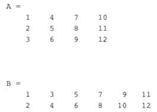

ND4J allows you to manipulate matrices with the standard linear algebra operations.

## Elementwise operations

For these to work, the two matrices have to be the same shape, because you have to pair each component of matrix A -- e.g. the element at row 1, column 1 -- with the same element in matrix B. Elementwise operations work for addition, subtraction, multiplication and division. Note that the product of elementwise multiplication is not the same at the product of matrix multiplication.

Here are two examples of elementwise addition:

Here's an example of elementwise multiplication:

## Scalar operations

Scalar operations are similar to elementwise operations, in that you take a scalar quantity -- i.e. a single integer such as 5 -- and use the operation to pair the scalar with each element of matrix A. In a sense, you pretend as though the scalar is the same shape as matrix A, populating every block. These also work for addition, subraction, multiplication and division.

Here's an example of scalar multiplication, where beta is any integer:

## Matrix multiplication

Slightly more complicated. To be multiplied, two matrices have to fulfill certain conditions. The number of columns in matrix A has to equal the number of rows of matrix B. In matrix notation, you always say the rows first and columns second; e.g. a matrix of two rows and three columns is a 2 by 3 matrix.

Matrix multiplication is possible between a 2 by 3 matrix and a 3 by 4 matrix, because the first matrix has three columns and the second has three rows. But it is not possible between a 2 by 3 and a 4 by 5.

The number of rows and columns are called dimensions in Matlab, and axes in the Python community. We're going to stick with Python's terminology and index. With ND4J

* if the axis equals 0, you add all of a column
* if the axis equals 1, you add all of a row.

When you collapse two vectors into one scalar by adding up the products of their matching elements, you obtain the **inner product**, or dot product. This type of multiplication recombines vectors from two matrices to produce a new matrix of scalars, each the inner product of two vectors.

Unlike simple numbers, matrices can be multiplied in different ways to obtain different results. Linear algebra has defined several ways of multiplying matrices by recombining elements and operations.

The **outer product**, for example, does the opposite of the inner product. Rather than compress vectors it expands them. So an m * 1 vector multiplied by a 1 * n vector produces a matrix of m * n.

## Matrix manipulation

* **Transpose:** The transpose of a matrix is its mirror image. An element located in row 1, column 3, in matrix A will be located in row 3, column 1, in the the transpose of matrix A, whose notation is A to the T, or A^T. Notice that the elements along the diagonal of a square matrix do not move -- they are at the hinge of the reflection.

* **Reshape:** Matrices can be reshaped. That is, you can change the number of rows and columns they have. The reshaped matrix has to fulfill one condition: the product of its rows and columns must equal the product of the row and columns of the original matrix. For example, proceeding columnwise, you can reshape a 3 by 4 matrix into a 2 by 6 matrix:

* **Linear view:** This is straight view of an arbitrary nd-array. You can go through the nd-array like a vector, linearly, squashing it into one long line. Linear view allows you to do nondestructive operations (reshape and other operations can be destructive because things get changed inside the nd-array). Linear views are only good for elementwise operations (rather than matrix operations), since the views do not preserve the order of the buffer.

* **View vs Copy:** Every nd-array has an internal data buffer where everything is stored contiguously. A linear view is a way of looking at that buffer, but it is not strictly a copy, because making a copy of hundreds of thousands of parameters is computationally expensive. There can be, say, 10 different ways of looking at the data in an nd-array, but only one copy of the data. Any nd-array can be formed if it's the same length, but you can also take a subset. You can look at the buffer in new ways via the offset (at what point do you start looking), the stride (how do you get to the next element), shape (how big is each dimension).
