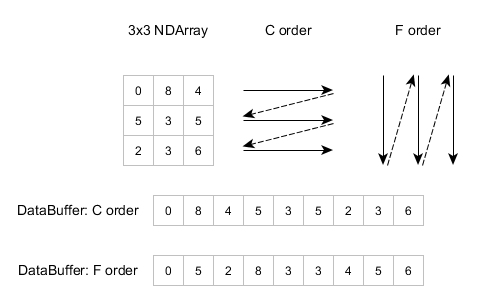
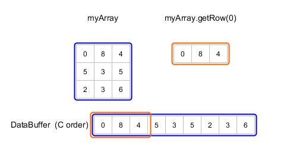
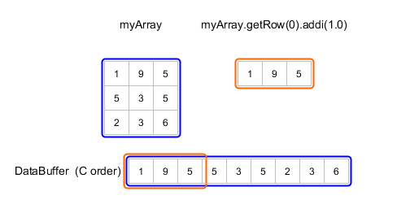
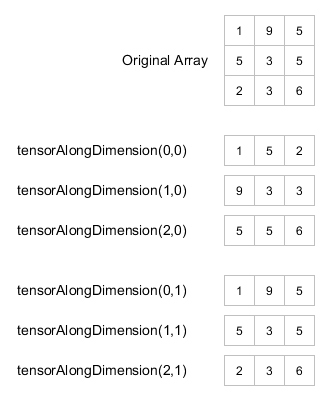
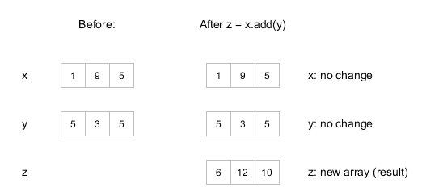
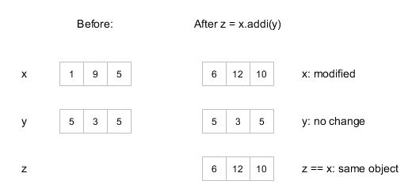
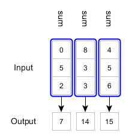
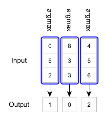
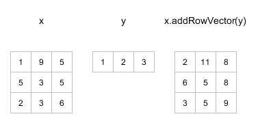

* <a href="getstarted">ND4Jのフルインストール</a>
* <a href="tensor">テンソルとND4J</a>
* <a href="userguide">ND4Jユーザーガイド</a>
* <a href="about">ND4Jとは</a>

このユーザーガイドは、ND4Jの主な機能性をご説明するものです（例もご紹介しています）。ただし、一部準備中のセクションもございます。ご了承ください。

* <a href="#intro">はじめに</a>
  * <a href="#inmemory">NDArrayはどのようにしてメモリに格納されるのか。</a>
  * <a href="#views">ビュー:2つ、またはそれ以上のNDArrayが同じデータを指す場合</a>
* <a href="#creating">NDArraysの作成</a>
  * <a href="#createzero">0、1、スカラー値の初期化配列</a>
  * <a href="#createrandom">疑似乱数の配列</a>
  * <a href="#createfromjava">Java配列でNDArrayを作成</a>
  * <a href="#createfromndarray">他のNDArrayでNDArrayを作成</a>
  * <a href="#createother">様々なNDArrayの作成方法</a>
* <a href="#individual">個々の値を入手し、設定</a>
* <a href="#getset">NDArraysのパーツを入手、設定</a>
  * <a href="#getsetrows">getRow()とputRow()</a>
  * <a href="#getsetsub">サブ行列： get()、put()、NDArrayIndex</a>
  * <a href="#getsettensor">Tensor Along Dimension</a>
  * <a href="#getsetslice">スライス</a>
* <a href="#ops">NDArrayでの演算</a>
  * <a href="#opsscalar">スカラー演算</a>
  * <a href="#opstransform">変換演算</a>
  * <a href="#accumops">累積（リダクション）演算</a>
  * <a href="#indexaccumops">インデックス累積演算</a>
  * <a href="#opsbroadcast">ブロードキャスト、及びベクトル演算</a>
* <a href="#boolean">ブールインデックス：状態に応じて選択した演算を適用</a>
* <a href="#misc">様々な高度なトピック</a>
  * <a href="#miscdatatype">データ型の設定</a>
  * Reshaping（再整形）
  * <a href="#miscflattening">Flattening<a>
  * 並べ替え（Permute）
  * sortRows/sortColumns
  * BLAS演算に直接アクセス
* <a href="#quickref">クイック参照：ND4Jメソッドのまとめ</a>
* <a href="#faq">よくある質問:（FAQ)</a>


## <a name="intro">はじめに</a>

NDArrayは、基本的にn次元の配列のことを指します。つまり、いくつかの次元を持った長方形状の数字配列のことです。

知っておくべきいつかの概念は以下の通りです。

* NDArrayの*ランク（rank）とは、次元数を指します。例えば、2次元NDArrayはランクが2で、3次元配列はランクが3です。NDArrayを任意のランクで作成することができます。
* NDArrayの*シェイプ（shape）は各次元のサイズを示します。例えば、3行5列の2次元配列があるとしましょう。このNDArrayのシェイプは`[3,5]`となります。
* NDArrayの*長さ（length）は配列の全要素数を設定します。長さは常にシェイプを構成する値の積と等しくなります。
* NDArrayの*ストライド（stride）は各次元にある連続的要素を区切るもの（下部にあるデータバッファにおいて）と定義されます。ストライドは次元ごとに設定されます。したがってランクNのNDArrayのストライド値は全部でNとなります。ほとんどの場合、ストライドを知っている（あるいは気にする）必要はありません。ND4Jが内部でどのようにして働いているのかさえ理解していればいいのです。ストライドの例は次のセクションでご紹介しましょう。
* NDArrayの*データ型（data type）は、NDArrayの種類のデータを指します（例えば、*float* または*double*精度）。これはND4J全体に設定されるので、すべてのNDArrayは同じデータ型でなければなりません。データ型の設定については後にご説明しましょう。

インデックス付けに関しては、知っておくべきことがいくつかあります。まず、行は次元0で、列は次元1です。したがって、: `INDArray.size(0)`は行数、`INDArray.size(1)`は列数を表します。ほとんどのプログラミング言語の正常な配列のように、インデックス付けはゼロで始まります。したがって例えば、列は`0`から`INDArray.size(0)-1`まであります。

ここでは、`NDArray`とはN次元配列の一般的な概念を指し、`INDArray`とはND4Jが指定する[Javaインターフェース](https://github.com/deeplearning4j/nd4j/blob/master/nd4j-backends/nd4j-api-parent/nd4j-api/src/main/java/org/nd4j/linalg/api/ndarray/INDArray.java)を指します。とはいえ、実際はこれら二語は同意語として使用されます。

### <a name="inmemory">NDArraysはどのようにしてメモリに格納されるのか。</a>

ここでND4Jの背景にある構造をご説明しましょう。ND4Jを使用するにはこれは理解しておかねばならないというわけではありませんが、コンテクストを理解するのに役立ちます。
NDArrayは単一の平らな数字の配列（より一般的には、連続した単一のメモリーブロック）としてメモリーに格納されます。このため、`float[][]`や`double[][][]`などのごく一般的なJavaの複数次元配列とはずいぶん異なります。

物理的に、INDArrayを送り返す データはオフ・ヒープで格納されます。つまり、Java仮想マシン（JVM）の外部に格納されています。これには数多くの利点があります。その性能の良さをはじめ、高性能のBLASライブラリとの相互運用性、高性能の計算においてJVMの欠点の一部が回避できることなどです（整数のインデックス付けのためJavaの配列が2^31 -1 （21.4億）要素に限定されるなどの問題）。

エンコードに関しては、NDArrayはC（行優先）順またはFortran（列優先）順のいずれかでエンコードすることができます。行と列の順序に関する詳細は、[Wikipedia（英語）]（https://en.wikipedia.org/wiki/Row-major_order)をご参照ください。Nd4JはCとFの順序を同時に両方使用することができます。ほとんどのユーザは、デフォルトの配列順序を使用するだけでいいのですが、必要な場合は配列に特定の順序を使用することも可能です。

次の画像はシンプルな3x3（2次元）NDArrayがどのようにしてメモリに格納されるのかを表したものです。



上記の配列には、以下のものがあります。

* `シェイプ = [3,3]`（3行、3列）
* `ランク = 2`（2次元）
* `長さ = 9` (3x3=9)
* ストライド
  * C順ストライド:`[3,1]`：連続した行の値はバッファーにより3つで区切られており、連続した列の値はバッファーにより1つで区切られています。
  * F順ストライド:`[1,3]`：連続した行の値はバッファーにより1つで区切られており、連続した列の値はバッファーにより3つで区切られています。

### <a name="views">ビュー:2つ、またはそれ以上のNDArrayが同じデータを指す場合</a>

ND4Jのカギとなるコンセプトは、2つのNDArrayはメモリ内にある同じデータを指し示すことができるということです。通常、ある一つのNDArrayが別の配列のサブセットを参照しますが、これが発生するのは特定の演算でのみです。`例えば、``INDArray.get()`、`INDArray.transpose()`、`INDArray.getRow()`などです。これはパワフルなコンセプトなので、理解しておくといいでしょう。

これには主に2つの動機があります。

1.かなりのパフォーマンス上の利点があります。特に配列の複製が防止できることです。
2.自分のNDArrayでどのように演算を実行するかについて、多くのパワーを得ることができる。

大きな行列（10,000 x 10,000）での行列転置のようなシンプルな演算について考えてみましょう。ビューを使用して、行列転置を一定時間で複製をせずに行うことができます（つまり、[ランダウの記号](https://en.wikipedia.org/wiki/Big_O_notation)のO(1)）。これにより、配列の要素をすべて複製するというかなりのコストを回避できます。もちろん、時には*複製が欲しい*こともあります。このときは、複製を得るために`INDArray.dup()`を使用することができます。例えば、転置された行列の*複製*を得るには、`INDArray out = myMatrix.transpose().dup()`を使用します。この`dup()`を呼び出した後、オリジナルの配列`myMatrix`と配列`out`の間の繋がりはなくなります（片方に行われた変更はもう片方に影響しません）。

ビューがどれほどパワフルかを知るには、単に1.0を大きめの配列`myArray`の最初の行に追加してみてください。これは1行で簡単にできます。

`myArray.getRow(0).addi(1.0)`

ここで何が起こっているのか詳しく見てみましょう。まず、`getRow(0)`により、オリジナルのビューであるINDArrayが返されます。`myArrays`と`myArray.getRow(0)`の両方がメモリ内の同域を指し示すことに注意してください。



それから、addi(1.0)が実行されると、以下のようになります。



`myArray.getRow(0)`によって返されたNDArrayへの変更はオリジナルの配列の`myArray`に反映されます。同様に、`myArray`への変更は行ベクトルに反映されます。

## <a name="creating">NDArraysの作成</a>

### <a name="createzero">0、1、スカラー値の初期化配列</a>

最も一般的に使用される配列を作成する二つの方法は次の通りです。

* `Nd4j.zeros(int...)`
* `Nd4j.ones(int...)`

配列のシェイプは整数で指定されます。例えば、ゼロで埋められた3行と5列の配列は`Nd4j.zeros(3,5)`を使用します。

これらは、しばしば他の演算と組み合わせて他の値の配列を作成することができます。例えば、10で埋められた配列を作成するには、以下のようにします。

`INDArray tens = Nd4j.zeros(3,5).addi(10)`

上記の初期化作業は2段階で行われます。まずゼロで埋められた3x5の配列を割り当て、次に各値に10を追加します。

### <a name="createrandom">疑似乱数の配列</a>

Nd4jは疑似乱数のINDArrayを発生させるためにいつかの方法を提供しています。

0から1の範囲で一貫して疑似乱数を発生させるには、`Nd4j.rand(int nRows, int nCols)` （2次元配列）または`Nd4j.rand(int[])`(3次元配列）を使用します。

平均ゼロと標準偏差1でガウス乱数を発生させるには、`Nd4j.randn(int nRows, int nCols)`または`Nd4j.randn(int[])`を使用します。

繰り返し発生させるには（ to set Nd4jの乱数発生シードの設定）、`Nd4j.getRandom().setSeed(long)`を使用します。

### <a name="createfromjava">Java配列でNDArrayを作成</a>

Nd4jはコンビニエンスメソッド（convenience method、便利なメソッド）を提供し、Javaのfloat配列及びdouble配列からの配列作成に使用しています。

1次元のJava配列から1次元のNDArrayを作成するには以下を使用します。

* 行 ベクトル：`Nd4j.create(float[])`または`Nd4j.create(double[])`
* 列ベクトル：`Nd4j.create(float[],new int[]{length,1})`または`Nd4j.create(double[],new int[]{length,1})`

2次元配列には`Nd4j.create(float[][])`または`Nd4j.create(double[][])`を使用します。

NDArraysを3次元以上のJavaプリミティブ配列（`double[][][]`など）で作成するには、以下を使用するのも一つのアプローチ方法です。

```java
double[] flat = ArrayUtil.flattenDoubleArray(myDoubleArray);
int[] shape = ...;	//配列のシェイプをここに入れます。
INDArray myArr = Nd4j.create(flat,shape,'c');
```

### <a name="createfromndarray"> 他のNDArrayでNDArrayを作成</a>

他の配列から配列を作成するには3つの基本的な方法があります。

* 既存のNDArrayと全く同じ複製を`INDArray.dup()`を使って作成する。
* 既存のNDArrayのサブセットとして配列を作成する。
* 複数の既存のNDArrayを組み合わせて新しいNDArrayを作成する。

二つ目の方法については、getRow()やget()などを使用することができます。詳細については、<a href="#getset">NDArraysのパーツを入手、設定）</a>をお読みください。

NDArrayを組み合わせる二つの方法は、`Nd4j.hstack(INDArray...)`と`Nd4j.vstack(INDArray...)`です。

`hstack`（「horizontal stack（横方向に積み重ねる）」こと）は、同じ行数を持つ多くの行列を引数として使用し、新しい配列を生み出すために水平方向に積み上げます。入力するNDArrayの列は異なる数でも問題ありません。

そして、方向が縦のものが`vstack`（「vertical stack（縦方向に積み重ねる）こと」）です。入力配列は列数が同じでなければなりません。


そして、時々、役に立つ他の方法は`Nd4j.diag(INDArray in)`です。この方法には、引数の`in`によって2つの利用方法があります。

* `in`がベクトルである場合は、diagは配列`in`と等しい対角のNxNの行列を出力します（Nは`in`の長さ）。
* `in`がNxN行列である場合は、diagは`in`の対角から取ったベクトルを出力します。

### <a name="createother">様々なNDArrayの作成方法</a>

サイズがNの[単位行列（identity matrix）](https://ja.wikipedia.org/wiki/%E5%8D%98%E4%BD%8D%E8%A1%8C%E5%88%97) を作成するには、`Nd4j.eye(N)`を使用します。

行ベクトルを要素の`[a, a+1, a+2, ..., b]`によって作成するには、以下のようなlinspaceコマンドが使用できます。

`Nd4j.linspace(a, b, b-a+1)`

Linspaceはreshape演算と組み合わせて、その他のシェイプを得ることができます。例えば、値が1から25を含めた5行5列の2次元NDArrayが欲しい場合は、以下を使用できます。

`Nd4j.linspace(1,25,25).reshape(5,5) `


## <a name="individual">個々の値を入手し、設定</a>

INDArrayについては、欲しい、または設定したい要素のインデックスを使用して値を入手または設定することができます。ランクNの配列（つまり、N次元配列）については、インデックスがN個必要です。

注意：個々に値を入手、または設定するのは一般的にパフォーマンス面から言うと望ましくはありません。可能な場合は、数多くの要素を使って同時に演算をするその他のINDArrayメソッドを使用するのがいいでしょう。

2次配列から値を得るには、以下を使用します。`INDArray.getDouble(int row, int column)`

すべての次元の配列に`INDArray.getDouble(int...)`を使用することができます。例えば、インデックスが値`i,j,k`を入手するには、`INDArray.getDouble(i,j,k)`を使用します。


値を設定するには、次の複数のputScalarメソッドのうちどれか一つを使用します。

* `INDArray.putScalar(int[],double)`
* `INDArray.putScalar(int[],float)`
* `INDArray.putScalar(int[],int)`

ここにおいて、`int[]`はインデックスで、`double/float/int`はそのインデックスに配置される値です。


その他の機能性である特定の状況において役に立つものに`NDIndexIterator`クラスがあります。NDIndexIteratorを使うと、設定した順序でインデックスを入手することができます（つまり、C順トラバーサル順序の[0,0,0], [0,0,1], [0,0,2], ..., [0,1,0]などのランク3配列など）。

2次元配列で値を繰り返し処理するには、以下を使用します。

```java
    NdIndexIterator iter = new NdIndexIterator(nRows, nCols);
    while (iter.hasNext()) {
        int[] nextIndex = iter.next();
        double nextVal = myArray.getDouble(nextIndex);
        //値に何かを設定します。
    }
```

## <a name="getset">NDArraysのパーツを入手、設定</a>

### <a name="getsetrows">getRow()とputRow()</a>

INDArrayから一行を入手するには、`INDArray.getRow(int)`を使用します。これにより、明らかに行ベクトルが返されます。
ここで注目に値することは、行がビューであるということです。返された行への変更はオリジナルの行列に影響します。これが非常に役に立つことがあります（例えば、`myArr.getRow(3).addi(1.0)`によって、1.0を大型の配列に3行目に追加します。）。行の複製が欲しい場合は`getRow(int).dup()`を使用します。

同様に、複数の行を入手するには、`INDArray.getRows(int...)`を使用します。これにより、行が積み重なった配列が返されます。しかし、ここで注意しなければならないことは、これはオリジナルの行の複製（ビューではない）であり、このNDArrayがメモリに格納されている方法ではビューは可能ではありません。

一行を設定するには、`myArray.putRow(int rowIdx,INDArray row)`を使用することができます。これにより、第`rowIdx`行目の`myArray`にINDArray`row`に含まれた値が設定されます。

### <a name="getsetsub">サブ行列： get()、put()、NDArrayIndex</a>

**Get:**

よりパワフルで一般的なメソッドは、`INDArray.get(NDArrayIndex...)`を使用することです。この機能性により、特定のインデックスを基にした任意のサブ配列を得ることができます。
例を使うと一番分かりやすいので、ここで例をご紹介しましょう。

一行を入手する（そして全列）には、以下を使用します。

`myArray.get(NDArrayIndex.point(rowIdx), NDArrayIndex.all()) `


行の範囲（行`a`（含まれる）から行`b`（含まれない））と全列を得るには、以下を使用します。

`myArray.get(NDArrayIndex.interval(a,b), NDArrayIndex.all())`

全行と隔列を入手するには、以下を使用します。

`myArray.get(NDArrayIndex.all(),NDArrayIndex.interval(0,2,nCols)) `

上記の例は2次元配列のみの場合ですが、NDArrayIndexのアプローチ方法は3次元以上も可能です。3次元については、上記のように2つだけでなく、3つのINDArrayIndexオブジェクトを提供します。


`NDArrayIndex.interval(...)`、`.all()`、`.point(int)`のメソッドは、常に下部にある配列のビューを返すということにご注意ください。したがって、`.get()`が返す配列はオリジナルの配列に反映されます。

**Put:**

同じNDArrayIndexアプローチ方法は、要素を別の配列に入れるためにも使用されます。この場合は、`INDArray.put(INDArrayIndex[], INDArray toPut)`メソッドを使用します。明らかに、NDArrayの`toPut`のサイズは提供されたインデックスが示唆するサイズと一致していなければなりません。


また、`myArray.put(NDArrayIndex[],INDArray other)`は機能的に`myArray.get(INDArrayIndex...).assign(INDArray other)`と同じであるということにご注意ください。これについても理由は`.get(INDArrayIndex...)`は下部にある配列の複製でなくビューを返すからです。


### <a name="getsettensor">Tensor Along Dimension</a>

(注意：ND4Jのバージョンの0.4-rc3.8及びそれ以前は、現在のバージョンと比べてTensor along dimension（次元に沿ったテンソル）メソッドに少し異なる結果を返します。）

Tensor along dimensionはパワフルなテクニックですが、最初は理解するのに時間が掛かるかもしれません。このメソッド（以下、TAD）の背景にある考えは、オリジナルの配列の<a href="#views">ビュー</a>である低いランクのサブ配列を得ることです。

このメソッドは以下の二つの引数を使用します。

- 返すテンソルの*インデックス*（0からnumTensors-1までの範囲）
- TAD演算を行う*次元*（1以上の値）

最もシンプルなケースは、2次元配列の1行または1列に沿ったテンソルです。以下の図で考えてみましょう。（次元0（行）はインデックスが縦に並び、次元1（列）はインデックスが横に並んでいます。）



ここで、次元が1つであるtensorAlongDimensionの呼び出しによる出力は、すべての場合において行ベクトルであることに注意してください。

なぜこのような出力なのかを理解するには、上図の最初のケースについて考えてみましょう。0番目（最初）のテンソルを次元0に*沿って*取っていきます（次元0は行）。 値の(1,5,2)は、次元0に沿って移動すると一直線に並んでいます。つまりこれが出力となります。同様に、`tensorAlongDimension(1,1)`は、次元1に沿った2番目の（*インデックス=1*）テンソルです。値の(5,3,5)は次元1に沿って移動すると一直線に並んでいます。


TAD演算は複数の次元でも実行可能です。例えば、TAD演算を行う2つの次元を指定すると、3次元（または4次元、5次元）配列から2次元のサブ配列を得ることができます。同様に、3次元を指定すると、4次元やそれ以上の配列から3次元を得ることができます。

TAD演算を役立てるには、出力について知っておくべきことが2つあります。

最初に、対象とする次元から得られるテンソルの数を知る必要があります。これを決めるには、「次元に沿ったテンソル数」の方法である`INDArray.tensorssAlongDimension(int... dimensions)`を使用することができます。このメソッドは、単に指定された次元に沿ったテンソル数を返すものです。上記の例では、以下のようになります。

* `myArray.tensorssAlongDimension(0) = 3`
* `myArray.tensorssAlongDimension(1) = 3`
* `myArray.tensorssAlongDimension(0,1) = 1`
* `myArray.tensorssAlongDimension(1,0) = 1`

（後者の2つの例の場合は、次元に沿ったテンソルは中にあるオリジナルの配列と同じ配列を出します。つまり、2次元配列からは2次元の出力があります）。

より一般的には、テンソルの*数*は残りの次元の積、テンソルの*シェイプ*は元のシェイプにある指定された次元のサイズです。

以下にその例をご紹介しましょう。

- 入力シェイプ[a,b,c]は、tensorssAlongDimension(0)によりテンソル数b*cが得られ、tensorAlongDimension(i,0)はシェイプ[1,a]のテンソルを返します。
- 入力シェイプ[a,b,c]は、tensorssAlongDimension(1)によりテンソル数a*cが得られ、tensorAlongDimension(i,1)はシェイプ[1,b]のテンソルを返します。
- 入力シェイプ[a,b,c]は、tensorssAlongDimension(0,1)によりテンソル数cが得られ、tensorAlongDimension(i,0,1)はシェイプ[a,b]のテンソルを返します。
- 入力シェイプ[a,b,c]は、tensorssAlongDimension(1,2)によりテンソル数aが得られ、tensorAlongDimension(i,1,2)はシェイプ[b,c]のテンソルを返します。
- 入力シェイプ[a,b,c,d]は、tensorssAlongDimension(1,2)によりテンソル数a*dが得られ、tensorAlongDimension(i,1,2)はシェイプ[b,c]のテンソルを返します。
- 入力シェイプ[a,b,c,d]は、tensorssAlongDimension(0,2,3)によりテンソル数bが得られ、tensorAlongDimension(i,0,2,3)はシェイプ[a,c,d]のテンソルを返します。

### <a name="getsetslice">スライス</a>

[ただいま準備中です。]

## <a name="ops">NDArrayでの演算</a>

Nd4JにはINDArrayを使って（またはINDArrayに対して）行いたい多くのことを実行するための演算の概念があります。
例えば、双曲正接演算、スカラーの追加、要素ごとの演算のように、演算によって何かを適用します。

ND4Jは5つの種類の演算を定義します。

* スカラー
* 変換
* 累積
* インデックス累積
* ブロードキャスト

そして以下の2つを行う方法も定義します。

* INDArray全体に直接実行、または
* 次元に沿って実行

これらの演算の詳細を見ていく前に、in-place（配列の変更）*演算と* copy（複製）演算について考えてみましょう。

多くの演算は、in-placeとcopyの両方があります。2つの配列を追加したいとしましょう。Nd4jはこれをするのに2つの方法を設定しています。`INDArray.add(INDArray)`と`INDArray.addi(INDArray)`です。前者（add）は、copy演算です。後者はin-place演算です。*addi* の*i*は「in-place」を意味します。この規則（*...i* は「in-place」を意味し、*i* が無いのはcopyを意味します）は、INDArrayインターフェイスでアクセス可能なその他の演算にも適用されます。

`x`と`y`の2つのINDArrayがあり、`INDArray z = x.add(y)`または`INDArray z = x.addi(y)`を行ったとしましょう。これらの演算の結果は以下の通りになります。





`x.add(y)`演算の場合、オリジナルの配列`x`は変更されていません。それに対して、in-place演算の`x.addi(y)`の場合は配列`x`は変更されています。add演算の両方のバージョンにおいて、結果を含むINDArrayが返されます。しかし、`addi`演算の場合は、結果の配列はオリジナルの配列`x`に過ぎません。

### <a name="opsscalar">スカラー演算</a>

[スカラー演算（Scalar ops）](https://github.com/deeplearning4j/nd4j/tree/master/nd4j-backends/nd4j-api-parent/nd4j-api/src/main/java/org/nd4j/linalg/api/ops/impl/scalar)とは、スカラー（つまり数字）も取る要素ごとの演算です。スカラー演算の例には、加算、最大値、乗算、除算があります（上のリンクにすべてのリストしたものがあります）。

`INDArray.addi(Number)`や`INDArray.divi(Number)`などの数多くの方法は、実際にスカラー演算を行います。したがって利用可能な場合はこれらの方法を使うほうが便利です。

スカラー演算をより直接的に行うには、例えば以下を使用するといいでしょう。

`Nd4j.getExecutioner().execAndReturn(new ScalarAdd(myArray,1.0))`

この演算で`myArray`が変更されていることに注意してください。使用したいのがこれではない場合は、`myArray.dup()`を使用してください。

その他の演算のように、スカラー演算は適切な次元に沿った解釈をしません。

### <a name="opstransform">変換演算</a>

変換演算（Transform Ops）は要素ごとの対数、コサイン、双曲正接、正規化線形関数などです。その他の例には加算、減算、複製演算などがあります。変換演算は要素ごとに使用されます（各要素に双曲正接）。しかし、常に同じとは限りません。例えばsoftmaxは通常、次元に沿って実行されます。

要素ごとに双曲正接演算を直接実行するには（NDArray全部に）、以下を使用してください。

`INDArray tanh = Nd4j.getExecutioner().execAndReturn(new Tanh(myArr))`
上述のスカラー演算のように、上述の方法を使った変換演算は*in-place*演算です。つまり、NDArray myArrが変更され、返された配列の`tanh`は実際に入力の`myArr`と同じオブジェクトです。複製が欲しい場合は、`myArr.dup()`を使用します。

[Transforms class（変換クラス）](https://github.com/deeplearning4j/nd4j/blob/master/nd4j-backends/nd4j-api-parent/nd4j-api/src/main/java/org/nd4j/linalg/ops/transforms/Transforms.java)は、`INDArray tanh = Transforms.tanh(INDArray in,boolean copy);`のようなconvenience methodsも定義します。これは上記の`Nd4j.getExecutioner()`を使った方法と同じです。

### <a name="opsaccum">累積（リダクション）演算</a>

累積（accumulation、またはリダクション、Reduction）の実行の場合、累積をNDArray全体に行うか特定の次元（一つ、あるいは複数）に沿って行うかによって重要な違いがあります。前者の場合（配列全体に実行）、値は一つしか返されません。後者の場合（次元に沿って累積）、新しいINDArrayが返されます。

配列のすべての値の総和を得るには、

`double sum = Nd4j.getExecutioner().execAndReturn(new Sum(myArray)).getFinalResult().doubleValue();`

を使用するか、同等に以下を使用します（こちらの方が便利）。

`double sum = myArray.sumNumber().doubleValue();`


累積演算は次元に沿って実行することも可能です。例えば、各列（各列とは、次元0に沿って、まらは「各行の値」）のすべての値の総和を得るには、以下を使用することができます。

`INDArray sumOfColumns = Nd4j.getExecutioner().exec(new Sum(myArray),0);`

または、同等に、以下を使用します。

`INDArray sumOfColumns = myArray.sum(0)`

これを3x3の入力配列で行ったとします。次元0に沿ったこの総計演算を図にすると、以下のようになります。



ここで、この入力のシェイプは`[3,3]`（3行、3列）であり、出力のシェイプは`[1,3]`であることに注意してください（つまり、出力は行ベクトル）。この演算を次元1に沿って行うと、シェイプが`[3,1]`である列ベクトルが出力されます。値は`(12,13,11)`となります。

次元が3つ以上あれば、次元に沿った累積もNDArrayに一般化されます。

### <a name="opsindexaccum">インデックスの累積演算</a>

[インデックスの累積演算（Index accumulation ops）](https://github.com/deeplearning4j/nd4j/tree/master/nd4j-backends/nd4j-api-parent/nd4j-api/src/main/java/org/nd4j/linalg/api/ops/impl/indexaccum)は累積演算に非常に類似しています。違いは、インデックスの累積演算は倍の値でなく整数のインデックスを返すということです。

インデックス累積演算の例に、IMax (argmax)、IMin (argmin)、IAMax（絶対値のargmax）があります。

配列の最大値のインデックスを得るには、以下を使用します。

`int idx = Nd4j.getExecutioner().execAndReturn(new IAMax(myArray)).getFinalResult();`

インデックス累積演算は、次元に沿って行うと最も役に立ちます。例えば、各列（つまり次元0に沿って、という意味）の最大値のインデックスを得るには、以下を使用します。

`INDArray idxOfMaxInEachColumn = Nd4j.getExecutioner().exec(new IAMax(myArray),0);`

これが3x3の入力配列で実行されたとしましょう。この次元0に沿ったargmax/IAMax演算を図にすると、以下のようになります。



上述の累積演算では、出力のシェイプは`[1,3]`となります。もし演算を次元1に沿って行うと、シェイプが`[3,1]`、値が`(2,0,2)`の列ベクトルとなったでしょう。


### <a name="opsbroadcast">ブロードキャスト、及びベクトル演算</a>

ND4Jはブロードキャスト演算、ベクトル演算をも設定します。

最も役に立つ演算に、addRowVectorやmuliColumnVectorなどのベクトル演算があります。

例として演算の`x.addRowVector(y)`を考えてみましょう。`x`は行列で`y`は行ベクトルです。この場合、`addRowVector`演算は行ベクトルの`y`を行列`x`の各行に追加します。以下はこれを図にしたものです。



その他の演算と同じく、inplaceとcopyのバージョンがあります。これらの演算には列バージョンもあり、例えば`addColumnVector`により、オリジナルのINDArrayの各列に列ベクトルが追加されます。

## <a name="boolean">ブールインデックス：状態に応じて選択した演算を適用</a>

[ただいま準備中です。]

[リンク:Boolean Indexing Unit Tests](https://github.com/deeplearning4j/nd4j/blob/master/nd4j-backends/nd4j-tests/src/test/java/org/nd4j/linalg/indexing/BooleanIndexingTest.java)

## <a name="misc">様々な高度なトピック</a>

### <a name="miscdatatype">データ型の設定</a>

ND4Jは現在、float精度値またはdouble精度値によるINDArrayによるバッキングを許可しています。デフォルトは単精度（float）です。ND4Jがdouble精度に配列全体に使用する順序を設定するには、以下を使用することができます。

0.4-rc3.8、及びそれ以前の場合、

```java
Nd4j.dtype = DataBuffer.Type.DOUBLE;
NDArrayFactory factory = Nd4j.factory();
factory.setDType(DataBuffer.Type.DOUBLE);
```

0.4-rc3.9、及びそれ以降の場合、

```java
DataTypeUtil.setDTypeForContext(DataBuffer.Type.DOUBLE);
```

### Reshaping（再整形）

[ただいま準備中です。]

### <a name="miscflattening">Flattening</a>

Flatteningとは、一つ以上のINDArrayを取り、一つの平らな配列（行ベクトル）に変換するプロセスです。

Nd4jは以下のメソッドを提供しています。

```java
Nd4j.toFlattened(char order, INDArray... arrays)
Nd4j.toFlattened(char order, Collection<INDArray>)
```
Nd4jはまた、多重定義されたtoFlattenedメソッドもデフォルト順序で提供します。順序の引数は、「c」や「f」である必要があります。これらは配列から取ってくる値の順序を設定します。c順序の場合は、[0,0,0]や[0,0,1]などの配列インデックスの順序を使用して平らにした配列になります（3次元配列）。f順序の場合、値が[0,0,0]や[1,0,0]などの順序で取られます。

### 並べ替え（Permute）

[ただいま準備中です。]


### sortRows/sortColumns

[ただいま準備中です。]


### BLAS演算に直接アクセス

[ただいま準備中です。]


### シリアライゼーション（Serialization）

[ただいま準備中です。]


## <a name="quickref">クイック参照:ND4Jメソッドのまとめ</a>

このセクションでは、ND4Jの最も一般的な演算についてまとめました。これらについての詳細は本ページの後方でご紹介しましょう。

このセクションでは、`arr`や`arr1`などはINDArrayであるとします。

**NDArrayの作成するには**:

* ゼロで初期化配列を作成：`Nd4j.zeros(nRows, nCols)`または`Nd4j.zeros(int...)`
* 1で初期化配列を作成：`Nd4j.ones(nRows, nCols)`
* NDArrayの複製を作成：`arr.dup()`
* `double[]`から行/列ベクトルを作成：`myRow = Nd4j.create(myDoubleArr)`、`myCol = Nd4j.create(myDoubleArr,new int[]{10,1})`
* `double[][]`から2次元NDArrayを作成：`Nd4j.create(double[][])`
* 大型の配列を作成するために配列のセットを積み重ねる：横方向、縦方向がそれぞれ`Nd4j.hstack(INDArray...)`、`Nd4j.vstack(INDArray...)`
* 一貫した乱数NDArrays:`Nd4j.rand(int,int)`、`Nd4j.rand(int[])`など
* Normal(0,1) の乱数NDArray：`Nd4j.randn(int,int)`、`Nd4j.randn(int[])`

**INDArrayのサイズ/次元を決定するには**：

以下のメソッドがINDArrayインターフェイスによって設定されています。

* 次元数を得る：`rank()`
* 2次元のNDArraysのみ：`rows()`、`columns()`
* i番目の次元のサイズ：`size(i)`
* int[]としてすべての次元のサイズを得る:`shape()`
* 配列内の要素数を決定：`arr.length()`
* その他：`isMatrix()`、`isVector()`、`isRowVector()`、`isColumnVector()`

**一つの値を入手し設定するには**：

* i行目、j列目で値を得る：`arr.getDouble(i,j)`
* 3次元以上の配列で値を得る：`arr.getDouble(int[])`
* 配列に値を一つ設定：`arr.putScalar(int[],double)`

**スカラー演算**:
スカラー演算は、double/float/int値を取り、それぞれに演算を行います。要素ごとの演算については、in-place演算とcopy演算があります。

* スカラー値を足す：arr1.add(myDouble)
* スカラーを値を引く: arr1.sub(myDouble)
* スカラーを値を掛ける： arr.mul(myDouble)
* スカラー値で割る： arr.div(myDouble)
* 逆減算 (scalar - arr1): arr1.rsub(myDouble)
* 逆除算 (scalar / arr1): arr1.rdiv(myDouble)


**要素ごとの演算をするには**：
注意：copy (add, mul, etc)演算、in-place (addi, muli)演算があります。前者では、arr1は変更されていません。後者ではarr1は変更されています。

* 加算:`arr1.add(arr2)`
* 減算:`arr.sub(arr2)`
* 乗算:`add1.mul(arr2)`
* 除算:`arr1.div(arr2)`
* 割り当て（arr1にある値をarr2にある値に割り当てる）：`arr1.assign(arr2)`

**リダクション（Reduction)演算（総和など）**;
これらの演算は配列全体に行われることに注意してください。`.doubleValue()` を呼び出し、返された数字の倍を得ます。

* 全要素の総和：`arr.sumNumber()`
* 全要素の積：`arr.prod()`
* L1とL2のノルム：`arr.norm1()`と`arr.norm2()`
* 全要素の標準偏差：`arr.stdNumber()`

**線形代数の演算**:

* 行列の乗算：`arr1.mmul(arr2)`
* 行列転置：`transpose()`
* 行列の対角を得る：`Nd4j.diag(INDArray)`
* 逆行列：`InvertMatrix.invert(INDArray,boolean)`

**大型のNDArrayから一部を取るには**:
注意：これらのメソッドは返されます。

* 行を得る（2次元NDArrayのみ）：`getRow(int)`
* 複数の行を行列として得る（2次元のみ）：`getRows(int...)`
* 行を設定する（2次元NDArrayのみ）：`putRow(int,INDArray)`
* 全列から最初の3行を得る：`Nd4j.create(0).get(NDArrayIndex.interval(0,3),NDArrayIndex.all());`

**要素ごとの変換（双曲正接、シグモイド、、サイン、対数など）**:

* [変換](https://github.com/deeplearning4j/nd4j/blob/master/nd4j-backends/nd4j-api-parent/nd4j-api/src/main/java/org/nd4j/linalg/ops/transforms/Transforms.java)を使用：`Transforms.sin(INDArray)`、`Transforms.log(INDArray)`、`Transforms.sigmoid(INDArray)`など
* 直接（メソッド1）：`Nd4j.getExecutioner().execAndReturn(new Tanh(INDArray))`
* 直接（メソッド2）：`Nd4j.getExecutioner().execAndReturn(Nd4j.getOpFactory().createTransform("tanh",INDArray))`

## <a name="faq">よくある質問（FAQ)</a>

**質問：ND4Jは疎行列（sparse array）に対応していますか?**

現在のところは対応していませんが、今後予定しています。

**質問：INDArrayのサイズを動的に増減させることはできますか?**
現バージョンのND4Jではできません。しかし、今後この機能を追加する可能性はあります。

以下のような応急処置があります。

1.新規配列を割り当て、複製する（例えばput()演算など）。
2.最初に、必要なものより大型のNDArrayを事前に準備します。次に、その配列のビューで演算します。そして、大型の配列が必要なときは、オリジナルの事前に割り当てた行列から大型のビューを得ます。
