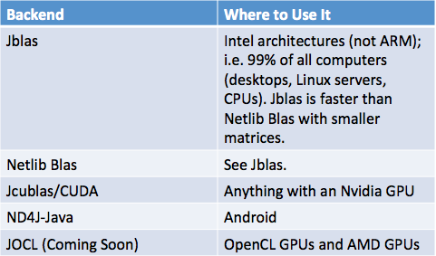
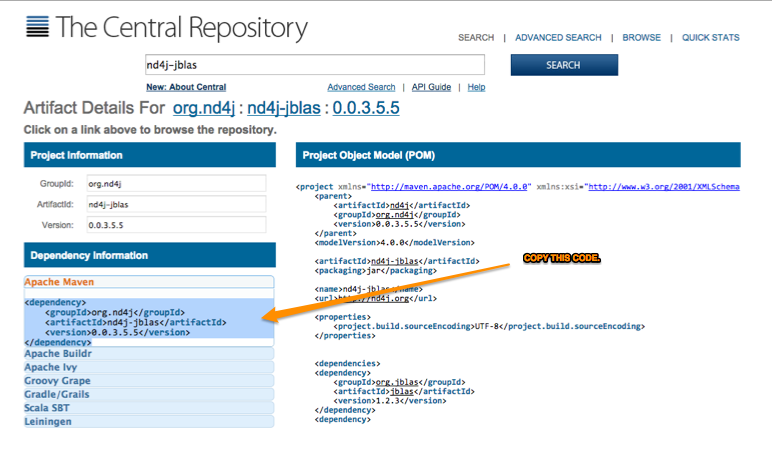
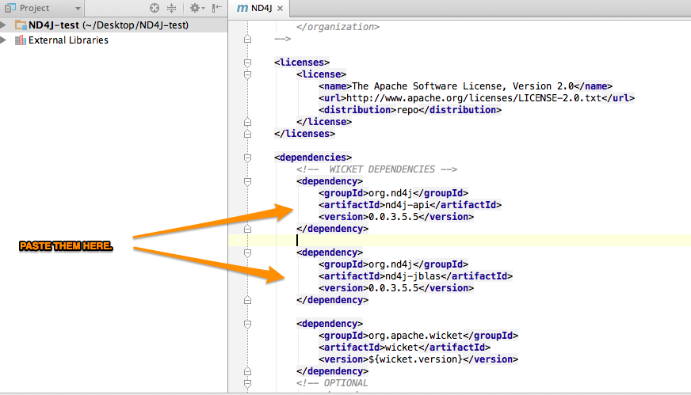

* <a href="index">ND4J: Java를 위한 N 차원 배열 (N-Dimensional Arrays)</a>
* <a href="getstarted">ND4J 전체 설치</a>
* <a href="dependencies">디펜던시(Dependencies)</a>

우선, 여러분은 여러분의 칩(chips)을 위해 올바른 디펜던시를 선택하셔야 합니다.



## POM.xml 파일 구성하기(configuring)

다음의 백엔드 중 하나를 선택하면 Maven이 자동으로 필요한 디펜던시를 설치합니다.

* `native` (default)
* [JCUBLAS](http://nd4j.org/gpu_native_backends.html) (for GPUs)

여러분의 루트 디렉터리로 가십시오. 예를 들어, nd4j 또는 deeplearning4j로 가셔서 [pom.xml 파일](https://maven.apache.org/pom.html)을 확인하십시오. 여러분은 `<dependencies> ... </dependencies>` 섹션에 정의된 백엔드를 보시게 됩니다. 다음 중 하나로 여러분이 전환하실 수 있습니다.

### Native
```xml
<dependency>
  <groupId>org.nd4j</groupId>
  <artifactId>nd4j-native</artifactId>
  <version>${nd4j.version}</version>
</dependency>
```
### 또는 CUDA (/GPUs)

여러분이 선택하실 수 있는 버전들을 보시려면 저희의 [GPU 페이지](http://nd4j.org/gpu_native_backends.html)로 가시기 바랍니다.
```xml
<dependency>
  <groupId>org.nd4j</groupId>
  <artifactId>nd4j-cuda-7.5</artifactId>
  <version>${nd4j.version}</version>
</dependency>
```
## 라이브러리의 최신 버전들을 찾고, 지정하는(specifying) 방법 (고급)

최신 버전들은 [search.maven.org](http://search.maven.org/#search%7Cga%7C1%7Cnd4j-jblas)에 있습니다. 아래 화면에서 "latest version"을 클릭 하십시오. 거기에서 디펜던시 정보를 복사하실 수 있습니다.



그 정보를 여러분의 pom.xml의 "dependencies" 섹션에 붙여 넣으십시면 다음이 IntelliJ에 나타나야 합니다:


