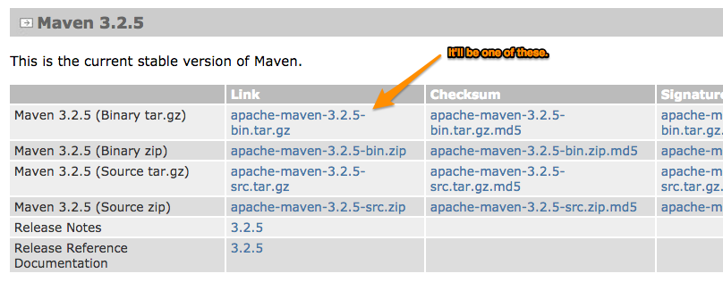
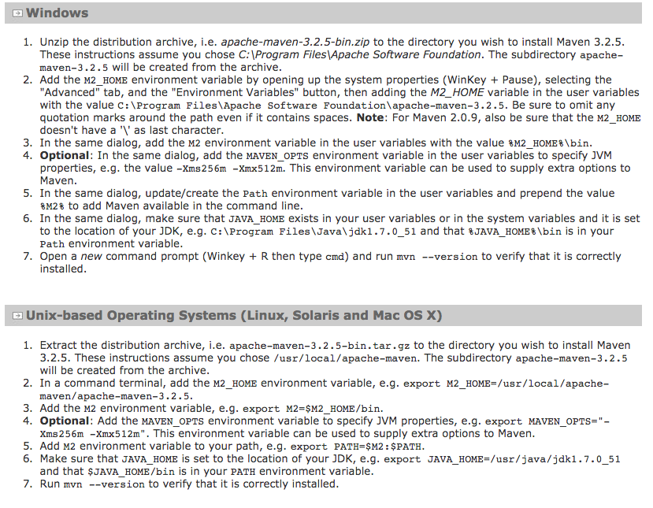
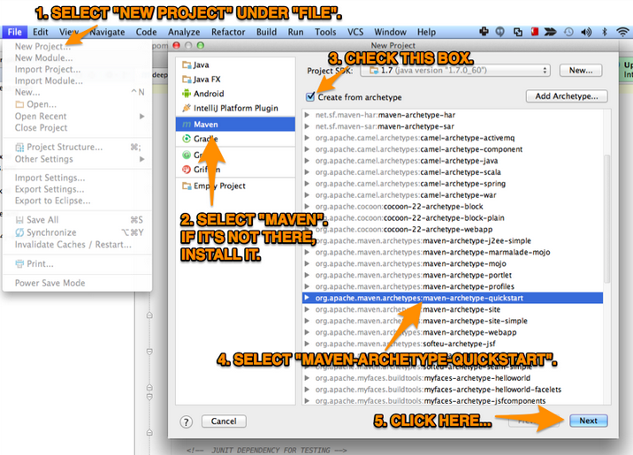
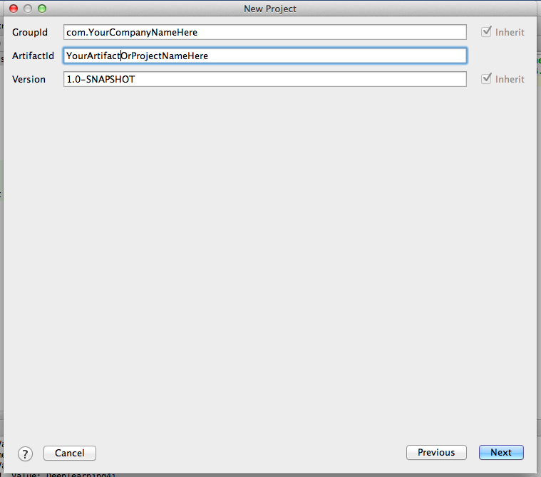

* <a href="index">ND4J: Java를 위한 N 차원 배열 (N-Dimensional Arrays)</a>
* <a href="getstarted">ND4J 전체 설치</a>
* <a href="dependencies">디펜던시(Dependencies)</a>

이것은 다단계 설치 입니다. 질문이나 피드백이 있으시다면 저희가 상세한 설명을 드릴 수 있도록 저희의 [Gitter Live Chat](https://gitter.im/deeplearning4j/deeplearning4j)에 가입하시기를 강력 추천드립니다. 비사교적 또는 완전 독립적인 성격이시라면 자율 학습 하실 수 있습니다.

ND4J 및 DL4J를 시작하려면 다음을 읽어주시기 바랍니다:

1. [Prerequisites](#prereq)
2. [통합 개발 환경(Integrated Development Environment)](#ide)
3. [새로운 ND4J 프로젝트](http://nd4j.org/getstarted.html#nd4j)
4. [개발 도구](#devtools)
5. [GPUs](http://nd4j.org/getstarted.html#gpu)
6. [다음 단계들](#next)

ND4J는 IntelliJ와 같은 IDE및 Maven과 같은 자동화 된 빌드 도구인 생산 배포에 익숙한 전문 자바 개발자를 대상으로 하는 오픈 소스 프로젝트 입니다. 만약 여러분이 이미 이 도구들에 익숙하시다면 저희의 도구가 여러분을 최상으로 도와드릴 것 입니다.

## <a id="prereq">Prerequisites</a>

시스템 구성(configuration) 요구 사항:

* [Java 7 혹은 이상](#java)
* [Maven 3.2.5 혹은 이상](#maven)

선택사항:
* [GPUs를 위한 Cuda 7](http://docs.nvidia.com/cuda/index.html#axzz3dlfIdQjP)
* [Scala 2.10.x](http://nd4j.org/getstarted.html#scala)
* [Windows](http://nd4j.org/getstarted.html#windows)
* [Github](http://nd4j.org/getstarted.html#github)

## <a id="java">Java 7 혹은 이상</a>

Java는 ND4J의 주요 인터페이스 및 네트워킹 언어입니다. 이는 수천 개의 노드로 배포된 클라우드 기반의 시스템에서부터 저용량 메모리 IoT 기기들까지 모두를 위해 사용되기 때문입니다. Java는 "한번 작성하면, 어디서든 실행할 수 있는" 언어입니다.

여러분이 가지고 있는 Java의 버전을 (혹은 가지고 있는지 여부를) 확인하려면, 커맨드 라인에 다음을 입력하세요:
```
java -version
```
Java 7이 컴퓨터에 설치되어 있지 않은 경우, [여기에서 Java Development Kit (JDK)](http://www.oracle.com/technetwork/java/javase/downloads/jdk7-downloads-1880260.html)를 다운로드 하실 수 있습니다. 최신의 Mac의 경우, Mac OS X를 언급하는 첫 번째 라인에 있는 파일을 원하실 것이며 (jdk-7u 뒤의 숫자가 각 업데이트와 함께 증가합니다.) 이는 다음과 같을 것입니다:
```
Mac OS X x64 185.94 MB -  jdk-7u79-macosx-x75.dmg
```
## <a id="maven">Maven</a>

Maven은 Java 프로젝트를 위한 자동화된 빌드 도구입니다 (이는 다른 여러 [용도들](http://maven.apache.org/what-is-maven.html) 중 하나 입니다). 이는 ND4J 및 DL4J 프로젝트 라이브러리의 최신 버전을 찾아주고 (.jar 파일들), 자동으로 다운로드 합니다. 이 저장소들은 [Maven Central](https://search.maven.org/#search%7Cga%7C1%7Cnd4j)상에서 찾으실 수 있습니다.

저희는 조금 더 심화된 [Java 프로그래머가 아닌 분들을 위한 Maven으로의 안내를 여기에](http://deeplearning4j.org/maven.html) 작성했습니다. Maven은 ND4J와 Deeplearning4j 프로젝트 모두를 쉽게 설치할 수 있게 합니다. 이는 IntelliJ와 같은 통합 개발 환경 (IDEs)과 잘 작동합니다.

Maven이 컴퓨터에 설치되어 있는지, 어떤 버전을 가지고 있는지 확인하려면, 커맨드 라인에 다음을 입력하세요:
```
mvn --version
```
만약 최신 버전의 Maven을 가지고 있지 않다면, 업데이트 해주시기 바랍니다. (현재 이는 3.3.x 입니다.) Maven 설치 방법은 [여기](https://maven.apache.org/download.cgi)에 있습니다. Maven의 최신 안정화된 버전을 포함하고 있는 압축 파일을 다운로드 하십시오.



이 페이지의 아래 부분에 있는 여러분의 운영 체제에 맞춰진 설명을 따르십시오; 예를 들어, "Unix 기반의 운영 시스템들 (Linux, Solaris 및 Mac OS X)." 이들은 다음과 같습니다:



## <a id="ide">통합 개발 환경: IntelliJ</a>

통합 개발 환경 ([IDE](http://encyclopedia.thefreedictionary.com/integrated+development+environment))는 여러분이 저희의 API와 작동하게 하고, 몇 번의 클릭만으로 여러분의 망(nets)을 구축하게 합니다. 설치된 Java의 버전과 작동하고 디펜던시들을 처리할 [Maven](#maven)과 의사소통 할 IntelliJ를 사용하시기를 권장합니다.

[IntelliJ](https://www.jetbrains.com/idea/download/)의 무료 커뮤니티 간행물에 설치 설명이 있습니다. 저희는 이를 선호하지만, [Eclipse](http://books.sonatype.com/m2eclipse-book/reference/creating-sect-importing-projects.html)와 [Netbeans](http://wiki.netbeans.org/MavenBestPractices)도 범용화된 통합 개발 환경 입니다. [여기에 Eclipse 상에서 ND4J/DL4J 패키지](https://depiesml.wordpress.com/2015/08/26/dl4j-gettingstarted/) 설치하는 안내가 있습니다.

## 새로운 ND4J 프로젝트 시작하기

IntelliJ 내에서 새로운 ND4J 프로젝트를 생성하려면, IntelliJ’의 시작 화면에서 “Open Project”를 클릭하거나 File/Open 탭을 클릭하고 “nd4j”를 선택하는 것 입니다. 만약 Github로부터 소스 파일들을 클론하셨다면, 그 디렉터리는 IntelliJ에서 이용 가능해야 합니다.

IntelliJ 내에서 새로운 ND4J 프로젝트를 생성하려면, 여러분의 프로젝트의 POM.xml 파일에 적절한 디펜던시들을 넣기만 하면 됩니다. 제대로 자리하고 있다면, Maven은 여러분을 위해 ND4J을 구축해 줄 것입니다. 적절한 디펜던시들을 여러분의 POM 값들에 붙여 넣기만 하면 ND4J 설치 완료 - 다른 어떤 설치도 필요하지 않습니다!

*maven-archetype-quickstart* 를 선택하십시오.



아래 이미지들은 여러분에게 Maven을 사용한 IntelliJ New Project Wizard의 창들로 안내할 것 입니다. 첫째, 여러분이 좋아하는 그룹 및 artifact의 이름을 정하십시오.



"Next"가 있는 다음과 같은 화면이 나올 때까지 클릭하시고, 그 다음 화면에서 여러분의 프로젝트 이름을 지정하신 후 마치기를 누르십시오 (예를 들어, "ND4J-test"). 이제 IntelliJ에 있는 여러분의 새로운 ND4J 프로젝트의 루트 내 POM.xml 파일로 이동하십시오.

여러분이 필요로 할 디펜던스들로 POM 파일을 업데이트 하십시오. 이들은 여러분께서 CPU 또는 GPU를 사용하시는 지의 여부에 따라 다를 것 입니다.

CPU를 위한 기본 백엔드는 `native` 이며, 이는 Netlib-blas에 강력하게 의존합니다. 이를 여러분의 POM의 `<dependencies> ... </dependencies>` 섹션에 다음과 같이 붙여 넣으실 수 있습니다.
```xml
<dependency>
  <groupId>org.nd4j</groupId>
  <artifactId>nd4j-native</artifactId>
  <version>${nd4j.version}</version>
</dependency>
```
ND4J의 버전이 여기에서 변수입니다. 이는 POM에서 다른 상위 라인을 참조할 것이며, `<properties> ... </properties>` 섹션에 있는 nd4j의 버전을 보여주고 다음과 비슷하게 보여질 것 입니다:
```xml
<nd4j.version>0.4-rc3.10</nd4j.version>
```
dl4j의 버전 역시 0.4-rc3.10이고, Canova의 버전은 0.0.0.13 입니다.

저희가 새로운 릴리스를 사용하면 버전의 숫자는 달라질 수 있습니다. [Maven Central에서 최신 버전을 반드시 확인하십시오]( https://search.maven.org/#search%7Cga%7C1%7Cnd4j). 여러분이 적절한 디펜던시와 nd4j 버전에 붙여 넣었다면, Maven은 자동으로 필요한 라이브러리들을 설치하고, 여러분은 ND4J을 실행하실 수 있어야 합니다.

백엔드가 `native`이어야 하지는 않습니다; Netlib Blas, 또는 GPUs를 위한 Jcublas로 전환될 수 있습니다. 이는 저희의 [디펜던시들](../kr-dependencies) 페이지에 더 심화된 구성 변경들과 함께 설명되어 있습니다. 또한 같은 페이지에 라이브러리들의 [최신 버전](http://search.maven.org/#search%7Cga%7C1%7Cnd4j)을 확인하는 방법에 대해서도 설명되어 있습니다.

여러분은 이제 IntelliJ 내에서 새로운 Java 파일을 생성하고, 분산 선형 대수학을 위한 ND4J의 API 사용을 시작하실 수 있습니다.

모든 새로운 IntelliJ 프로젝트로 생성된 App.java 파일을 열고, public static void main( String[] args ) 뒤에 있는 중괄호 사이에 코드를 작성하기 시작하십시오.

아직 적절한 패키지들을 가져 오지 않았기 때문에 많은 클래스들이 빨간색으로 표시될 것 입니다. 그러나 IntelliJ가 여러분의 파일의 상단에 자동으로 패키지들을 추가할 것 입니다. 패키지들을 자동으로 로드하게 하기 위해 여러분의 OS에 맞는 적절한 hot keys를 조회하십시오.

(몇 개의 시작 작업들을 위한 저희의 [intro](http://nd4j.org/introduction.html)를 참조하십시오. IntelliJ에서 ND4J는 autocomplete 하므로, 어떤 문자로 새로운 라인을 시작하면 그 문자를 포함한 모든 ND4J 커맨드 목록이 보여질 것 입니다.)

## GitHub & Source

Github는 웹 기반의 [개정 제어 시스템(Revision Control System)](https://en.wikipedia.org/wiki/Revision_control)으로, 오픈 소스 프로젝트를 위한 [사실상의 호스트](http://opensource.com/life/12/11/code-hosting-comparison) 입니다.

만약 여러분께서 committer로서  ND4J에 기여할 계획을 가지고 있지 않으시다거나, 최신의 알파 버전이 필요하지 않으시다면, 저희는 [Maven Central]( https://search.maven.org/#search%7Cga%7C1%7Cdeeplearning4j)으로부터 ND4J의 가장 최신의 안정화된 출시 자료인 0.4-rc1.x를 다운로드 하시기를 추천 드립니다. JAR 파일들은 [Maven Central]( https://search.maven.org/#search%7Cga%7C1%7Cnd4j)에서 직접 다운로드 가능합니다. 혹은, [source]( http://nd4j.org/source)를 보시기 바랍니다.

## <a id="scala">Scala</a>

Scala는 ND4J와 작동하기 위해서 설치가 필요한 것은 아닌 반면에, 저희는 [ND4S]( https://github.com/deeplearning4j/nd4s)로 알려진 저장소 아래에 [Scala API]( http://nd4j.org/scala.html)를 가지고 있습니다. Scala는 JVM 상에서 실행되는 강력한 static type 시스템을 가진 멀티패러다임 언어입니다. 다시 말해 Scala는 Java와 같은 OOP 속성들 뿐만 아니라 Scheme 및 Haskell과 유사한 기능적인 프로그래밍 기능을 가지고 있으며, 그 구조는 프로그램을 간결하게 유지하게 합니다. 여러분은 Scala와 함께 Java 라이브러리들을 이용하실 수 있습니다. 여러분이 실행해 볼 수 있는 Scala로 작성된 신경망 예제들이 있는데, 이는 Spark 구현에 필요합니다.

여러분이 가지고 있는 Scala의 버전을 (혹은 가지고 있는지 여부를) 확인하려면, 커맨드 라인에 다음을 입력하세요:
```
scala -version
```
Scala를 설치하시려면 [Scala download page](http://www.scala-lang.org/download/2.10.4.html)를 방문하십시오.

ND4J는 Scala 2.10.4와 호환 가능하고, Scala는 이전 버전과 호환 가능하지 않습니다. [Homebrew](http://brew.sh/)는 Mac 사용자들이 Scala를 설치하는 것을 도와줄 것 입니다. brew install scala는 여러분이께서 최신의 버전인 2.11.x얻게 할 것 입니다. Scala 2.10.x을 Homebrew과 함께 설치하시려면, [이 페이지](https://github.com/ofishel/hb-scala-2.10.4)를 보시기 바랍니다.
여러분께서는 또한 IntelliJ 플러그인을 통해 Scala와 작업하실 수 있습니다. (IntelliJ에 플러그인을 추가하시려면, IntelliJ IDEA/Preferences/IDE Setting/Plugins/ 탭에 가셔서 Scala를 검색하십시오.)

## <a id="canova">Canova</a>

[Canova](https://github.com/deeplearning4j/Canova)는 저희가 기계 학습 도구들을 위해 개발한 일반 벡터화 lib 입니다. 이는 저희의 신경망과 함께 작동 할 수 있는 svmLight, libsvm 및 ARFF와 같이 raw data를 사용 가능한 벡터 형식으로 벡터화 합니다.

### Canova 설치하기

[Canova](http://search.maven.org/#search%7Cga%7C1%7Ccanova-parent)를 설치하려면 ND4J를 위해 [Maven](http://nd4j.org/getstarted.html#maven)을 설치할 때 사용한 동일한 단계들을 따르십시오. 저희는 현재 버전 0.0.0.5-SNAPSHOT을 사용하고 있습니다.

## Deeplearning4j 설치하기

Deeplearning4j 버전들은 POM의 속성(properties) 섹션에 하드 코딩된 버전으로, ND4J를 위해 했던 것과 동일한 방법으로 지정되어야 하고, 그 버전 변수는 각 디펜던시에 언급되어 있습니다.

여러분이 POM에 추가한 DL4J 디펜던시들은 여러분의 프로젝트의 성격에 따라 달라집니다.

핵심 디펜던시 뿐만 아니라, 아래에 보여진 것과 같이, 여러분은 또한 커맨드 라인 인터페이스를 위한 deeplearning4j-cli를, Hadoop 또는 Spark 상의 병렬 실행을 위한 deeplearning4j-scaleout, 혹은 다른 것들을 필요에 따라 설치하실 수 있습니다.
```xml
		<dependency>
		  <groupId>org.deeplearning4j</groupId>
		  <artifactId>deeplearning4j-core</artifactId>
		  <version>${deeplearning4j.version}</version>
		</dependency>
```
Deeplearning4j 설치에 대한 더 많은 정보는 [Getting Started page](http://deeplearning4j.org/kr-gettingstarted.html)에서 가능합니다.


## <a id="devtools">OSX, Windows 및 Linux의 C를 위한 개발 도구들</a>

Windows나 Linux OS에서 특정 ND4J 디펜던시들을 컴파일 하려면, 여러분은 gcc를 포함한 C를 위한 몇 개의 개발 도구들을 설치해야 합니다. 여러분이 gcc를 가지고 있는지 확인하려면, 여러분의 터미널 혹은 커맨드 프롬프트에 gcc -v를 입력하시기 바랍니다.

## OSX

[Apple developer tool Xcode](https://developer.apple.com/xcode/downloads/)의 일부 버전은 여러분을 위해 gcc를 설치해 줄 것 입니다. 만약 gcc를 가지고 있지 않으시다면 여러분의 커맨드 프롬프트에 brew install gcc를 입력해 주십시오.

## OpenBlas
`native` 백엔드 상에서 네이티브 libs들이 작동하는지 보시려면, 시스템 경로 상에 /opt/OpenBLAS/lib가 필요합니다. 그 다음, 프롬프트에 다음의 커맨드들을 입력하십시오.
```
sudo cp libopenblas.so liblapack.so.3
sudo cp libopenblas.so libblas.so.3
```
이는 [Spark](http://deeplearning4j.org/spark)가 OpeBlas와 작동할 수 있게 하기 위해 추가 되었습니다.
만약 OpenBlas가 제대로 작동하지 않으면, 다음의 단계들을 따르십시오.
* 여러분께서 설치하셨던 OpenBlas를 삭제하십시오.
* sudo apt-get remove libopenblas-base를 실행하십시오.
* OpenBLAS이 개발 버전을 다운로드 하십시오.
* git clone git://github.com/xianyi/OpenBLAS
* cd OpenBLAS
* make FC=gfortran
* sudo make PREFIX=/usr/local/ install
* Linux라면, libblas.so.3 와 liblapack.so.3 를 위한 symlink들이 여러분의 LD_LIBRARY_PATH 어딘가에 보여지는지 재확인하시기 바랍니다. 만약 보이지 않는다면, 그 symlink들을 /usr/lib에 추가하십시오. Symlink는 “symbolic link” 입니다. 여러분께서 다음과 같이 설정하실 수 있습니다. (-s 가 그 link를 symbolic하게 합니다.):
	ln -s TARGET LINK_NAME
	// interpretation: ln -s "to-here" <- "from-here"
* 위의 “from-here”는 아직 존재하지 않지만, 여러분이 생성하실 symbolic link 입니다. [symlink를 생성하는 방법](https://stackoverflow.com/questions/1951742/how-to-symlink-a-file-in-linux)에 StackOverflow 가 있습니다. 또한 여기에 [Linux 페이지](http://linux.die.net/man/1/ln)가 있습니다.
* 마지막 단계로 여러분의 IDE를 재시작 하십시오.
* Centos 6와 함께 네이티브 Blas 작동하는 방법을 위한 전체 설명을 원하시면, [이 페이지를 보시기 바랍니다](https://gist.github.com/jarutis/912e2a4693accee42a94).

Ubuntu (15.10) 상의 OpenBlas를 위해서는 [이 설명들](http://pastebin.com/F0Rv2uEk)을 보시기 바랍니다. 몇몇의 추가적인 훈련들이 OpenBlas 작동을 위해 필요할수 있습니다:
```
cd OpenBLAS
make FC=gfortran
sudo make PREFIX=/usr/local/ install

sudo ln -s libopenblas.so libblas.so.3
sudo ln -s libopenblas.so liblapack.so.3
```
윈도우 상의 OpenBlas를 위해서, [이 파일](https://www.dropbox.com/s/6p8yn3fcf230rxy/ND4J_Win64_OpenBLAS-v0.2.14.zip?dl=1)을 다운로드 하십시오. 이를 C:/BLAS와 같은 위치에 압축을 풀어주십시오. 마지막으로 그 디렉토리를 여러분의 시스템의 경로 환경 변수에 추가해주시기 바랍니다.

## Windows

Windows 사용자들은 무료 [Visual Studio Community 2013 혹은 이상](https://www.visualstudio.com/en-us/products/visual-studio-community-vs.aspx)을 설치해야 합니다. 수동으로 그 경로를 여러분의 PATH 환경 변수에 추가해야 합니다. 그 경로는 이와 같을 것입니다:
```
C:\Program Files (x86)\Microsoft Visual Studio 12.0\VC\bin
```
여러분의 CMD에 "cl"을 입력 하십시오. 특정 .dll 파일들이 누락되어 있슴을 알리는 메시지가 나타날 수 있습니다. 여러분의 VS/IDE 폴더가 그 경로 내에 있는지 확인하십시오 (위 참조). 만약 여러분의 CMD이 "cl"을 위한 사용 정보를 보여준다면 이는 제 위치에 있슴을 의미합니다.

만약 여러분께서 Visual Studio를 사용하신다면:

* 경로 환경 변수가 \bin\를 가리키도록 설정하십시오 (cl.exe, 등의 경우)
* 또한 ND4J에서 mvn clean install을 하시기 전에 환경을 설정하기 위해서 vcvars32.bat (또한 bin 내에서)를 실행하도록 하십시오. (이것은 여러분께서 주위 headers를 복사하는 것을 막아 줍니다.)
* vcvars32가 일시적일 수 있으므로, 여러분은 ND4J mvn install을 하고자 할 때 마다 이를 실행하셔야 할 필요가 있습니다.
* Visual Studio 2015를 실행하고 경로 변수를 설정한 후, 환경 변수들 (INCLUDE, LIB, LIBPATH)을 설정하기 위해서 아마도 vcvars32.bat을 실행할 필요가 있을 것이고, 이로 인해 여러분은 header 파일들을 복사하실 필요가 없습니다. 하지만 만약 익스플로러로부터 bat 파일을 실행하시면, 그 설정들이 일시적이므로 제대로 설정되지 않았을 것 입니다. 그러므로  mvn install과 같이 그 동일한 CMD 창에서vcvars32.bat를 실행하시면, 모든 환경 변수들이 올바르게 설정될 것 입니다.
* 그들이 어떻게 설정되어야 하는지가 여기에 있습니다:

	INCLUDE = C:\Program Files (x86)\Microsoft Visual Studio 12.0\VC\include
	LIB = "C:\Program Files (x86)\Microsoft Visual Studio 12.0\VC\lib"
	//so you can link to .lib files^^

* Visual Studio에서, 여러분은 또한 C++를 클릭하셔야 합니다. 이는 더 이상 기본적으로 설정되지 않습니다. (추가적으로, Java CPP를 위한 이 include 경로가 항상 윈도우 상에서 작동하지는 않습니다. 한가지 해결 방법은 header 파일들을 Visual Studio 의 include 디렉터리에서 가져와 Java가 설치된 곳인 Java Run-Time Environment (JRE)의 include디렉터리에 넣는 것 입니다. 이는 standardio.h와 같은 파일들에 영향을 미칠 것 입니다.
* Git, IntelliJ 및 Maven과의 예제들을 설치하는 연습을 위해서는 저희의 [Quickstart 페이지](http://deeplearning4j.org/quickstart.html#walk)를 봐 주십시오.
* 이 페이지는 윈도우 64 플랫폼을 위한 dll을 구하는 방법에 대해 설명합니다.
* dll 라이브러리들을 다운로드 하시고 그들을 Java bin 폴더에 위치하게 하십시오 (예를 들면, C:\prg\Java\jdk1.7.0_45\bin).
* 라이브러리 netlib-native_system-win-x86_64.dll는 libgcc_s_seh-1.dll libgfortran-3.dll libquadmath-0.dll libwinpthread-1.dll libblas3.dll liblapack3.dll에 의존 합니다.
* (liblapack3.dll 및 libblas3.dll는 단지 libopeblas.dll의 이름을 변경한 복사본들 입니다.)
* 여러분께서는 [여기](http://sourceforge.net/projects/mingw-w64/files/Toolchains%20targetting%20Win64/Automated%20Builds/), [여기](http://www.openblas.net/), 혹은 [여기](http://search.maven.org/#search%7Cga%7C1%7Ca%3A%22netlib-native_system-win-x86_64%22)에서 컴파일된 libs를 다운로드 하실 수 있습니다.

## Linux

Linux로 Ubuntu 및 Centos 사용자들은 두 개의 별도 세트의 설명을 따라야 합니다:

### Ubuntu

Ubuntu를 위해서는, 우선 다음을 입력하십시오:
```
sudo apt-get update
```
그 다음 이 커맨드의 한 버전을 실행할 필요가 있습니다:
```
sudo apt-get install linux-headers-$(uname -r) build-essential
```
$(uname -r)은 여러분의 Linux 버전에 따라 달라질 수 있습니다. Linux 버전을 확인하려면, 여러분의 터미널의 새로운 창을 열고 이 커맨드를 입력하시기 바랍니다:
```
uname -r
```
3.2.0-23-generic과 같은 것을 보시게 될 것 입니다. 무엇이든 그것을 복사해 스크립트의 첫 번째 라인에 ($uname -r) 대신해서 붙여 넣으십시오. 그리고 한 칸을 삽입하고 build-essential을 입력하십시오. 오타 조심하시기 바랍니다. 커맨드를 완료하기 위해 탭을 누르십시오.

### Centos

루트 사용자로서 터미널 (또는 ssh 세션)에 다음을 입력합니다:
```
yum groupinstall 'Development Tools'
```
그 후, 여러분은 터미널 상에 많은 활동과 설치들을 보시게 됩니다. 어떤, 예를 들어, gcc를 가지고 있는지 확인하려면, 다음의 라인을 입력하십시오:
```
gcc --version
```
더 자세한 설명은 [여기](http://www.cyberciti.biz/faq/centos-linux-install-gcc-c-c-compiler/)로 가시기 바랍니다.

## GPUs
[CUDA 백엔드를 추가하는 설명은 여기에 있습니다](http://nd4j.org/gpu_native_backends.html). 저희는 CUDA 버전 7.5 및 8을 지원 합니다.
여러분께서 GPUs 상에서 신경망을 학습하시기 시작하면, GPU가 작동하는지, 얼마나 잘 작동하는지 모니터 하고자 할 것 입니다. 여러분께서 취할 수 있는 몇가지 방법들이 있습니다:
여러분께서 [nvcc, Nvidia 컴파일러](http://docs.nvidia.com/cuda/cuda-compiler-driver-nvcc/)를 클래스경로(src/main/resources)에 가지고 있는지 확인하십시오. 저희는 즉석에서 커널들을 컴파일 합니다.
[Nvidia Management Interface (SMI)](https://developer.nvidia.com/nvidia-system-management-interface)를 설치하십시오. 출력에서 Java를 찾으십시오.
```xml
<dependency>
  <groupId>org.nd4j</groupId>
  <artifactId>nd4j-cuda-7.5</artifactId>
  <version>${nd4j.version}</version>
</dependency>
```
## <a id="next">다음 단계들</a>

이제 여러분은 [예제들](http://nd4j.org/introduction.html)을 실행할 준비가 된 것 입니다. 저희는 여러분께서 여러분의 IDE를 착수, ND4J 프로젝트를 로드하고 예제들의 하위 디렉토리를 열기를 권장 합니다. IntelliJ 창의 왼쪽에 있는 파일 트리에서 한 예를 찾은 후 오른쪽 클릭하시고, 드롭 다운 메뉴에서 "Run"을 위한 녹색 화살표를 선택하십시오.

모든 것이 올바르게 설치 되었다면 여러분은 IntelliJ 창 하단에 프로그램 출력으로서 숫자들이 나타나는 것을 보시게 됩니다. 이들을 실험 시작을 위한 샌드 박스로 사용하십시오.

이 예제들이 익숙하시다면 POM 파일들에 정의된 디펜던시들을 변경하실 수 있습니다. [디펜던시들을 변경하는 방법은 여기에서](http://nd4j.org/gpu_native_backends.html) 배우시기 바랍니다.

## 유용한 링크:

* [ND4J Maven 저장소](http://mvnrepository.com/artifact/org.nd4j)
* [DeepLearning4j.org (한글)](http://deeplearning4j.org/kr-index.html)
* [DeepLearning4j Maven 저장소](http://mvnrepository.com/artifact/org.deeplearning4j)
